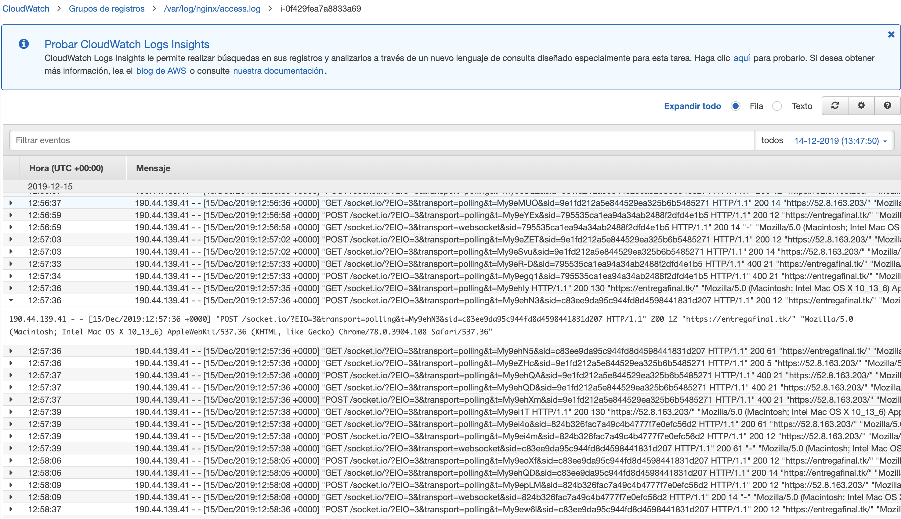
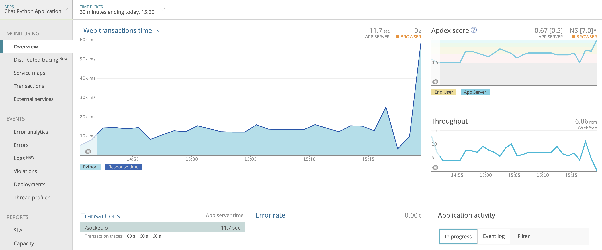

# Chat app

IIC2173 - Entrega Final Arquitectura de Sistemas de Software

## Integrantes

| Nombre               | Número de alumno |
| -------------------- | ---------------- |
| Tomás Alvarez        | 1563700J         |
| Francisco Larach     | 15634957         |
| Miguel Ramírez       | 15633438         |
| Florencia Valladares | 1463614J         |
| Isidora Vizcaya      | 15633144         |

## Desafíos

### (1) Make my life serverless

Pasos a seguir:

1. API

* Ir a la API (`ShoppinAPI`) y hacerle deploy en `actions`. Se pide info del `stage` que puede ser cualquier nombre.
* Esto lleva a otra página donde aparece un link que permite probar la API.
* Para la función GET hay que copiar el link, pegarlo en el buscador y agregar `/item` y mostrará los items presentes
* Para la función POST es necesario usar un software o la extensión de Chrome para manejo de las APIs. En esa extensión, se debe poner que se tiene un método POST, el link agregando `/cart` para poner cosas en el carrito de shopping, y después especificar que es un `json`. El cuerpo debe ser del siguiente estilo:

```JSON
{
“items”: [“123456”, “789012”],
“user”: “me”
}
```

* Se envía el POST, y saldrá que se creó un carro con un estado 200.
* Finalmente se debe ir a las funciones lambda y revisar los logs de la API para revisar que todo esté correcto. Para esto se debe ir a la función lambda de la API, luego ir a `Monitoring`, donde se deberá apretar el botón que dice `View logs in CloudWatch` para ver todos los requests hechos durante los pasos anteriores. Luego, la función lambda es triggered cuando se usa la API.

2. S3

* Ingresar a Amazon S3 y buscar el creado `aws-lambda-trigger`. Ahí se debe apretar `upload` para subir un archivo y luego seleccionar un archivo con datos en formato `json`.
* Ir a las funciones lambda y revisar los logs de la S3 para revisar que todo se realizó correctamente. Para esto se debe ir a la función lambda de la API, luego ir a `Monitoring`, donde se deberá apretar el botón que dice `View logs in CloudWatch` para ver todos los logs de lo realizado en los pasos anteriores. Con esto se puede ver que la función lambda es triggered cuando se usa la base de datos del S3 y lo que retorna.

3. Kinesis

Para la función lambda sobre kinesis es la misma idea que la anterior con s3.

* Ingresar a Amazon Kinesis y buscar el creado. Ahí realizar algún cambio, por ejemplo, realizar un stream de datos.
* Ir a las funciones lambda y revisar los logs de la S3 para revisar que todo se realizó correctamente. Para esto se debe ir a la función lambda de la API, luego ir a `Monitoring`, donde se deberá apretar el botón que dice `View logs in CloudWatch` para ver todos los logs de lo realizado en los pasos anteriores. Con esto se puede ver que la función lambda es triggered cuando se usa o hacen cambios en kinesis.

### (3) Local NSA

1. Los __logs__ se encuentran conectados a través del servicio `awslogs`. La configuración de los logs se encuentra en el archivo `/var/awslogs/etc/awslogs.conf`. Actualmente se muestran los de sistema, deploy y de acceso a la aplicación en CloudWatch. En la siguiente imágen se muestran los logs de acceso a la aplicación.

Se realizó la configuración siguiendo este [tutorial](https://docs.aws.amazon.com/AmazonCloudWatch/latest/logs/QuickStartEC2Instance.html)

2. Para instalar __NewRelic__ se generó el archivo `newrelic.ini` en el servidor (ver archivo en __branch__ `server`) que permite hacer la conexión con el __dashboard__. Para asociar la aplicación al archivo de agregó en el archivo `/etc/supervisor/conf.d/` lo siguiente:

```python
command=/home/ubuntu/.local/bin/newrelic-admin run-program /home/ubuntu/iic2173-chat-app/venv/bin/gunicorn -k eventlet -w 1 main:app
environment=PATH="/home/ubuntu/iic2173-chat-app/venv/bin/",NEW_RELIC_CONFIG_FILE="/home/ubuntu/iic2173-chat-app/newrelic.ini"
```

Así siempre al iniciar el servidor se va a montar la aplicación y su estado estará conectado con __New Relic__.


### (5) Beyond Travis

1. Archivos `buildspec.yml` y `appspec.yml` en repositorio
2. Build y deploys exitosos

3. Pipeline contra push a master del repositorio

4. Deploy logs a CloudWatch


### (6) Load Balancer

1. Esta es la configuración de cómo se ven las instancias corriendo en nuestro EC2. Respecto a lo solicitado en este punto se puede apreciar que hay 2 instancias autogeneradas por ASG (Auto-Scaling-Group), las cuales se pueden acceder desde los link en los detalles.

2. En este paso se puede ver como efectivamente se llevó a cabo la configuración del Load Balancer, el cual mantiene las 2 instancias corriendo, proveyendo de los servicios a los clientes.
3. Aquí se ve la configuración del Auto Scaling Group, el cual mantiene un óptimo y mínimo de 2 instancias corriendo y 5 máximo. Así, al usar más de un 50% de su capacidad agrega una instancia y si tiene menos del 10% remueve una.
4. Aquí se muestran las configuraciones de lanzamiento de las instancias a través del ASG, con la configuración de la AMI dada por una instancia que queremos “replicar”.

5. Finalmente, podemos ver la configuración del CDN en Cloudfront, que permite ingresar a la información mediante el link dado en los detalles.
Además de tener un link de “logs”, como se señala en la última línea.


Algunos links con detalles:

* [Load Balancer](http://lb-2-2032493292.us-west-1.elb.amazonaws.com/)
* [CDN](http://d19tniwbjvzank.cloudfront.net/)
* [LogBucket (XML)](http://elasticbeanstalk-us-west-1-478789511478.s3.amazonaws.com/)
