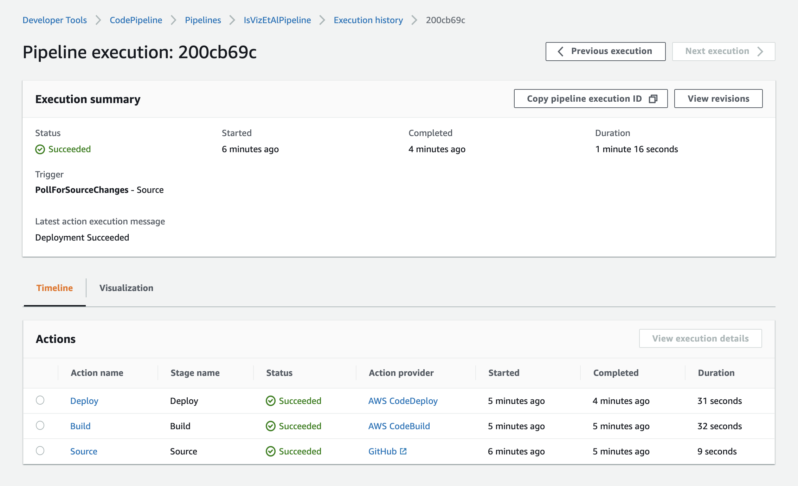
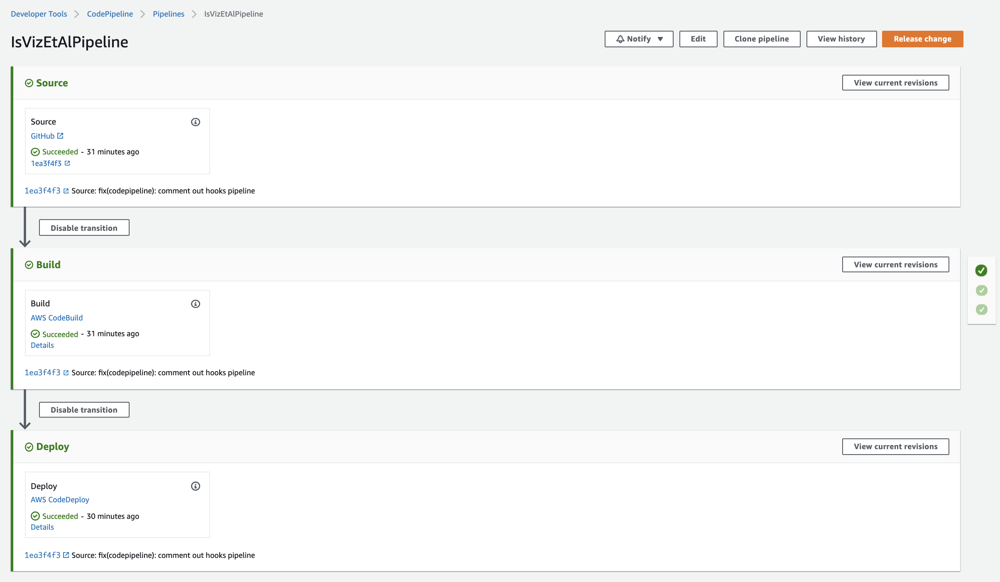
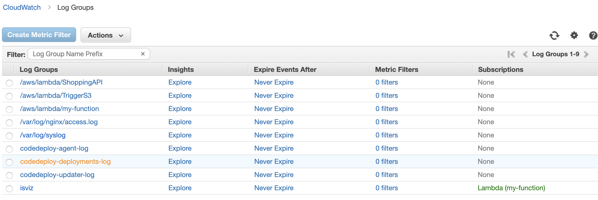
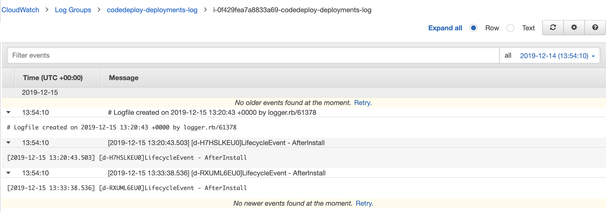

# Chat app

IIC2173 - Entrega Final Arquitectura de Sistemas de Software

## Integrantes

| Nombre               | Número de alumno |
| -------------------- | ---------------- |
| Tomás Alvarez        | 1563700J         |
| Francisco Larach     | 15634957         |
| Miguel Ramírez       | 15633438         |
| Florencia Valladares | 1463614J         |
| Isidora Vizcaya      | 15633144         |

## Desafíos

### (1) Make my life serverless

### (3) Local NSA

### (5) Beyond Travis

1. Archivos `buildspec.yml` y `appspec.yml` en repositorio
2. Build y deploys exitosos

3. Pipeline contra push a master del repositorio

4. Deploy logs a CloudWatch

### (6) Load Balancer
