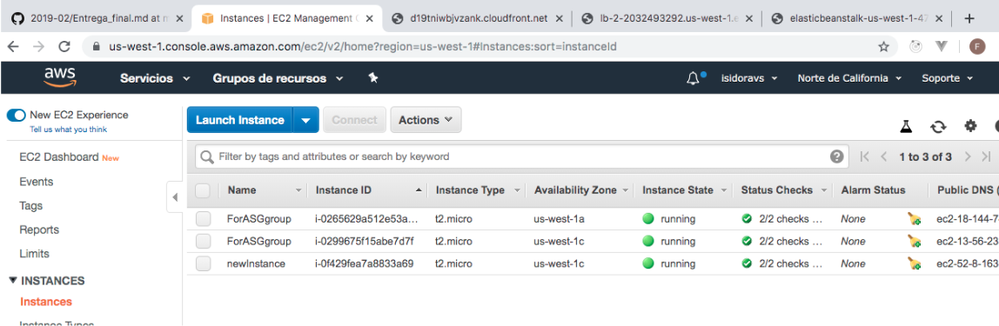
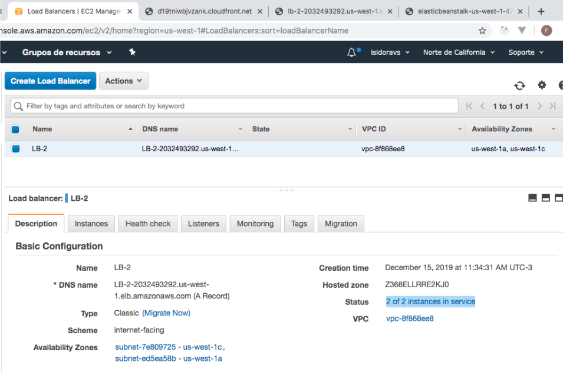
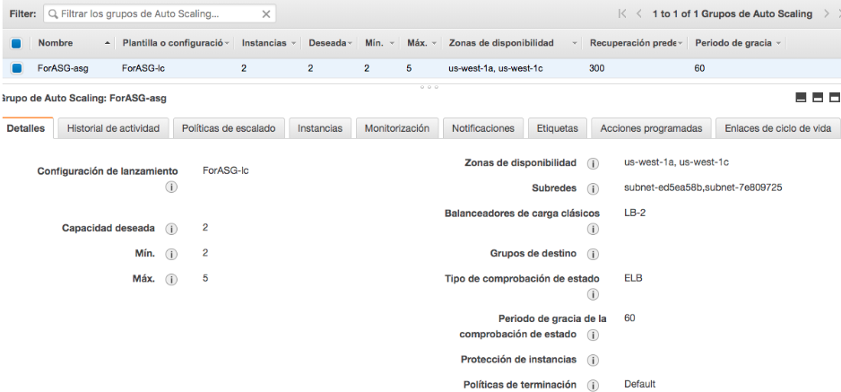
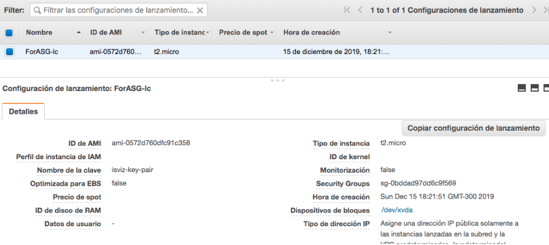
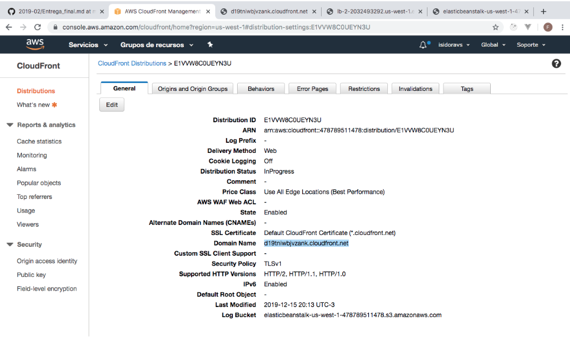

# Chat app

IIC2173 - Entrega Final Arquitectura de Sistemas de Software

## Integrantes

| Nombre               | Número de alumno |
| -------------------- | ---------------- |
| Tomás Alvarez        | 1563700J         |
| Francisco Larach     | 15634957         |
| Miguel Ramírez       | 15633438         |
| Florencia Valladares | 1463614J         |
| Isidora Vizcaya      | 15633144         |

## Desafíos

### (1) Make my life serverless

### (3) Local NSA

### (5) Beyond Travis

1. Archivos `buildspec.yml` y `appspec.yml` en repositorio
2. Build y deploys exitosos

3. Pipeline contra push a master del repositorio

4. Deploy logs a CloudWatch

### (6) Load Balancer

1. Esta es la configuración de cómo se ven las instancias corriendo en nuestro EC2. Respecto a lo solicitado en este punto se puede apreciar que hay 2 instancias autogeneradas por ASG (Auto-Scaling-Group), las cuales se pueden acceder desde los link en los detalles.

2. En este paso se puede ver como efectivamente se llevó a cabo la configuración del Load Balancer, el cual mantiene las 2 instancias corriendo, proveyendo de los servicios a los clientes.
3. Aquí se ve la configuración del Auto Scaling Group, el cual mantiene un óptimo y mínimo de 2 instancias corriendo y 5 máximo. Así, al usar más de un 50% de su capacidad agrega una instancia y si tiene menos del 10% remueve una.
4. Aquí se muestran las configuraciones de lanzamiento de las instancias a través del ASG, con la configuración de la AMI dada por una instancia que queremos “replicar”.

5. Finalmente, podemos ver la configuración del CDN en Cloudfront, que permite ingresar a la información mediante el link dado en los detalles. 
Además de tener un link de “logs”, como se señala en la última línea.

Detalles: 
Link de Load Balancer: http://lb-2-2032493292.us-west-1.elb.amazonaws.com/

Link de CDN: http://d19tniwbjvzank.cloudfront.net/

Supuesto LogBucket Link [XML]: http://elasticbeanstalk-us-west-1-478789511478.s3.amazonaws.com/